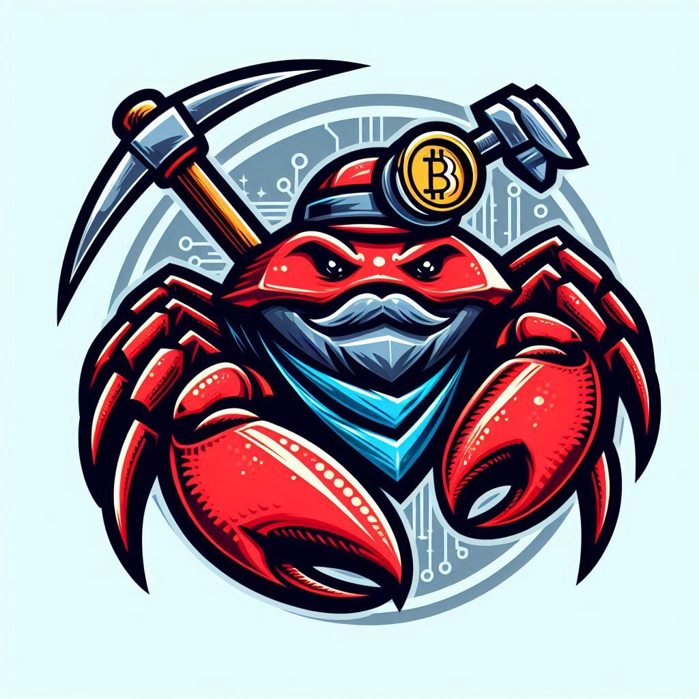

# 0xBlockPay Smart Contract Audit Repository



## Table of Contents
1. Introduction
2. Resources
   - [Audits](#audits)
   - Articles
   - Cheat Sheets
   - Projects
   - Report Writing
3. Tools
4. Methodologies
5. Code Examples
   - [Account Abstraction](#account-abstraction)
6. License

## Introduction
Welcome to the Smart Contract Audit Repository! This repository contains resources, tools, and code examples to help you learn and practice smart contract auditing.

## Resources

### Audits
- [PasswordStore](./2024-09-25-password-store.pdf)
- [PuppyRaffle](./2024-09-26-puppy-raffle.pdf)
- [SantasList](./2024-09-27-santas-list.pdf)
- [Ethernaut](./2024-09-30-ethernaut.pdf)
- [FuzzTest](./2024-10-04-fuzz.pdf)
- [T-Swap](./2024-10-04-t-swap.pdf)
- [MysteryBox](./2024-09-30-mystery-box.pdf)
- [ThunderLoan](./2024-10-15-thunder-loan.pdf)
- [StarkNet](./2024-10-10-starknet.pdf)
- [TrickOrTreat](./2024-10-24-trick.pdf)

### Articles
- Basics of Smart Contract Auditing
- Advanced Techniques in Smart Contract Security
- Defi invarient

### Cheat Sheets
- Solidity Syntax
- Common Vulnerabilities

### Projects
- Malware Analysis
- Penetration Testing

### Report Writing
- Sample Audit Report
- Report Template

## Tools
- MythX
- Slither
- Remix IDE

## Methodologies
- OWASP Smart Contract Security
- Audit Methodology

## Code Examples
### Account Abstraction

Account abstraction in Ethereum is a proposed upgrade that aims to make interacting with the blockchain more flexible and user-friendly. Here are the key points:

### What is Account Abstraction?
Account abstraction allows for more flexible programming of security and user experiences within Ethereum accounts. Instead of relying solely on externally owned accounts (EOAs) controlled by private keys, account abstraction enables accounts to be controlled by smart contracts1.

### Benefits of Account Abstraction:
Flexible Security Rules: Users can define their own security rules within their accounts, adding layers of security beyond just private keys.

1) Enhanced Recovery: Users can set up backup mechanisms to regain access to their accounts if they lose their private keys.

2) Sharing Security: Users can share the security of their account with trusted devices or individuals.

3) Gas Flexibility: Users can pay gas fees using tokens other than ETH, simplifying the management of gas funds.

4) Batch Transactions: Complex actions, like approving and executing swaps in one go, become more straightforward.

5) Innovative dApps: Developers have greater freedom to innovate and create user-friendly decentralized applications (dApps).

### How It Works:
Account abstraction involves upgrading EOAs so they can be controlled by smart contracts, or upgrading smart contracts so they can initiate transactions. This allows for more complex and user-friendly interactions with the Ethereum network.

### Why It Matters:
Account abstraction aims to improve the overall user experience on Ethereum by making it easier to interact with the blockchain, reducing the need for users to manage private keys, and providing more options for security and transaction flexibility.

#### POC

`forge init`

`git add .`

`git commit -m "account abstraction init"`

`forge install OpenZeppelin/openzeppelin-contracts`

to `src/AccountAbstraction.sol`

```javascript
// SPDX-License-Identifier: MIT
pragma solidity ^0.8.0;

import "@openzeppelin/contracts/access/Ownable.sol";
import "@openzeppelin/contracts/token/ERC20/IERC20.sol";

contract AccountAbstraction is Ownable(msg.sender) {
    mapping(address => bool) private accountHolders;

    constructor() {
        accountHolders[msg.sender] = true;
    }

    function addAccountHolder(address _accountHolder) public onlyOwner {
        accountHolders[_accountHolder] = true;
    }

    function removeAccountHolder(address _accountHolder) public onlyOwner {
        accountHolders[_accountHolder] = false;
    }

    function isAccountHolder(address _accountHolder) public view returns (bool) {
        return accountHolders[_accountHolder];
    }

    function transferTokens(address token, address recipient, uint256 amount) public {
        require(isAccountHolder(msg.sender), "Not an account holder");
        IERC20(token).transferFrom(msg.sender, recipient, amount);
    }
}
```

to `test/AccountAbstraction.t.sol`

```javascript
// SPDX-License-Identifier: MIT
pragma solidity ^0.8.0;

import "forge-std/Test.sol";
import "../src/AccountAbstraction.sol";
import "@openzeppelin/contracts/token/ERC20/ERC20.sol";

contract MockERC20 is ERC20 {
    constructor(uint256 initialSupply) ERC20("MockERC20", "MERC") {
        _mint(msg.sender, initialSupply);
    }
}

contract AccountAbstractionTest is Test {
    AccountAbstraction accountAbstraction;
    MockERC20 token;
    address owner = address(0x1);
    address accountHolder = address(0x2);
    address nonAccountHolder = address(0x3);


    function setUp() public {
        token = new MockERC20(1000 ether);
        vm.startPrank(owner);
        accountAbstraction = new AccountAbstraction();
        accountAbstraction.transferOwnership(owner);
        vm.stopPrank();
    }

    function testAddAccountHolder() public {
        vm.prank(owner);
        accountAbstraction.addAccountHolder(accountHolder);
        assertTrue(accountAbstraction.isAccountHolder(accountHolder));
    }

    function testRemoveAccountHolder() public {
        vm.prank(owner);
        accountAbstraction.addAccountHolder(accountHolder);
        vm.prank(owner);
        accountAbstraction.removeAccountHolder(accountHolder);
        assertFalse(accountAbstraction.isAccountHolder(accountHolder));
    }

    function testTransferTokens() public {
        vm.prank(owner);
        accountAbstraction.addAccountHolder(accountHolder);
        token.transfer(accountHolder, 100 ether);
        vm.prank(accountHolder);
        token.approve(address(accountAbstraction), 50 ether);
        vm.prank(accountHolder);
        accountAbstraction.transferTokens(address(token), nonAccountHolder, 50 ether);
        assertEq(token.balanceOf(nonAccountHolder), 50 ether);
    }

    function testFailTransferTokens_NotAccountHolder() public {
        vm.prank(nonAccountHolder);
        accountAbstraction.transferTokens(address(token), owner, 50 ether);
    }
}
```

to `remappings.txt`

```sh
@openzeppelin/contracts/=lib/openzeppelin-contracts/contracts/
```

and run
`forge test`


## License
This project is licensed under the MIT License - see the LICENSE file for details.

---

If you have any questions or suggestions, please feel free to open an issue or submit a pull request.

!Smart Contract Audit Image

### Defi invarient

Protocols that are widely used and recognized in the cryptocurrency space:

- Uniswap: A decentralized exchange (DEX) that allows users to swap tokens directly from their wallets without the need for an intermediary.
- Aave: A lending and borrowing platform that offers features like flash loans, which allow users to borrow and repay funds within a single transaction.
- MakerDAO: A protocol that enables users to generate a stablecoin (DAI) by locking up collateral in a smart contract.
- Compound: A DeFi platform that allows users to lend and borrow cryptocurrencies, with interest rates that are algorithmically determined.
- Curve: A DEX that focuses on stablecoin trading, offering low slippage and efficient trades.
- SushiSwap: A fork of Uniswap, SushiSwap includes additional features like staking rewards for liquidity providers.
- dYdX: A decentralized exchange that offers advanced trading features, including perpetual contracts and spot trading.
- Balancer: A protocol that allows users to create and trade multi-asset portfolios with customizable weights.
- Lido: A liquid staking solution that allows users to stake their Ethereum and earn rewards while maintaining liquidity.
- De.Fi: A platform that provides analytics and portfolio management tools for DeFi users.

#### Uniswap (V2)
Uniswap uses the Constant Product Market Maker (CPMM) invariant. The invariant ensures that the product of the reserves of two tokens in a liquidity pool remains constant:

𝑥⋅𝑦=𝑘

Where:
𝑥 is the reserve of token A.
𝑦 is the reserve of token B.
𝑘 is a constant value representing the product of the initial reserves.

#### Aave
Aave's invariant ensures that the total value supplied to the protocol (deposits plus interest) should be greater than or equal to the total value borrowed (loans plus interest):

Total Deposits + Accrued Interest ≥ Total Borrows + Accrued Debt

#### MakerDAO

MakerDAO ensures that the value of the collateral locked in the system is greater than or equal to the value of the outstanding DAI loans:

Collateral Value ≥ DAI Debt ⋅ Liquidation Ratio

#### Compound

Compound's invariant ensures that the total supply of tokens is equal to the total borrow of tokens, adjusted for interest rates:

∑Supply = ∑Borrow ⋅(1+Interest Rate)

#### Curve

Curve uses the StableSwap invariant to maintain the balance of stablecoins in its pools:

$$ A \cdot n^n \cdot \sum x_i + D = D \cdot A \cdot n^n + \frac{D{n+1}}{nn \cdot \prod x_i} $$

Where:

𝑥𝑖 represents the balance of the 
𝑖 -th token in the pool.
𝐷 is the total amount of tokens in the pool when they have an equal price.
𝐴 is the amplification coefficient.
𝑛 is the number of tokens in the pool.

#### SushiSwap
SushiSwap also uses the Constant Product Market Maker (CPMM) invariant similar to Uniswap:

𝑥⋅𝑦=𝑘

Where:

𝑥 is the reserve of token A.
𝑦 is the reserve of token B.
𝑘 is a constant value representing the product of the initial reserves.

These invariants are fundamental in ensuring the stability, security, and efficiency of these DeFi protocols.

#### dYdX
dYdX uses cross-margining, which means that the margin and leverage are shared across all open positions. The invariant ensures that the total equity in the account is sufficient to cover the potential losses from all open positions:

Equity = Margin⋅(1+Leverage)

Where:

Equity is the total value of the user's account.
Margin is the amount of collateral (usually USDC) deposited by the user.
Leverage is the factor by which the user's position is amplified.
This invariant ensures that the user's account has enough margin to cover potential losses, even when using leverage.

#### Balancer
Balancer allows users to create and trade multi-asset portfolios with customizable weights. The balance invariant for Balancer pools ensures that the value function remains constant:

∑𝑖=1𝑛𝑤𝑖⋅𝑥𝑖=𝑘

Where:

𝑤𝑖 is the normalized weight of the 
𝑖 -th token in the pool.

𝑥𝑖 is the balance of the 
𝑖 -th token in the pool.

𝑘 is a constant value representing the total value of the pool.

#### Lido
Lido is a liquid staking solution that allows users to stake their Ethereum and earn rewards while maintaining liquidity. The balance invariant for Lido ensures that the stETH (staked ETH) tokens maintain a 1:1 ratio with the underlying staked ETH:

stETH=ETH

This invariant ensures that for every unit of ETH staked, one unit of stETH is issued, and vice versa when stETH is redeemed.